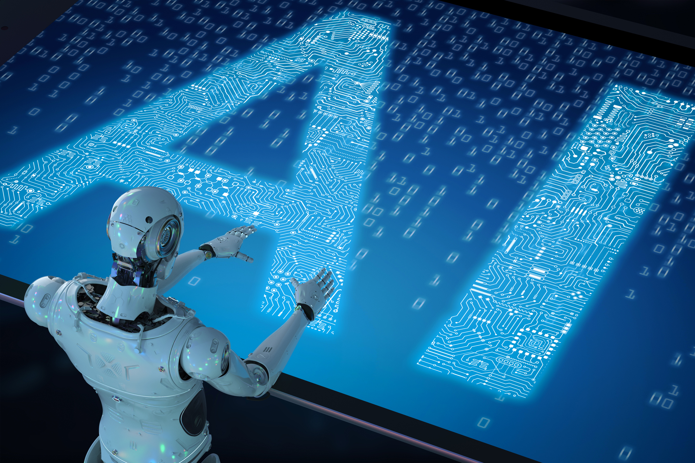

We've all seen tasteless, cringy images like the one above: a shiny, usually white, humanoid robot in some cliché scenario supposedly representing our shared technological future. Along with the ubiquitous Terminator images, these **inappropriate and/or terrible** pictures of robots are arguably the most visible of all misconceptions and inaccuracies about AI. We explicitly say **inappropriate and/or terrible** because we are, in fact, dealing with two separate (albeit usually intersecting) phenomena. Let’s begin with the more straightforward of the two: **inappropriate robots**.

##Inappropriate robots
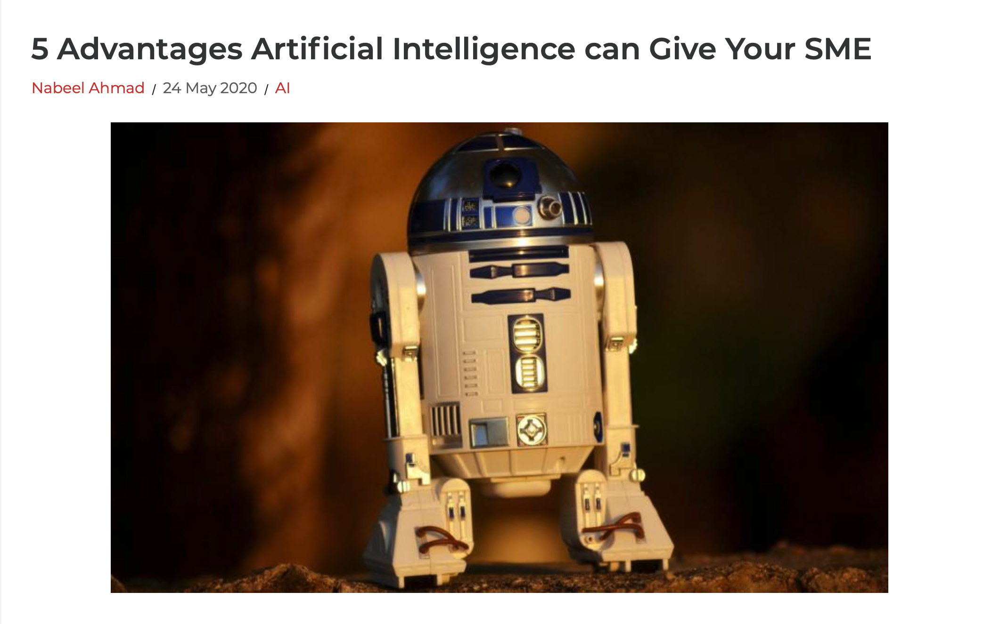

What we see in the image above is a picture of a (very famous) robot being used to [illustrate an article about small and medium enterprises (SMEs)](https://readwrite.com/2020/05/24/5-advantages-artificial-intelligence-can-give-your-sme/)
, a topic which in this case has nothing to do with robotics, at least in the physical sense. Such image-text combinations are in themselves harmless, and often quite hilarious for how misguided they are. The typical example consists of a news article about some topic with an artificial intelligence component to it, but nothing to do with robotics, being illustrated by a picture of a (usually) humanoid robot. Here are a couple of examples:

An [article about AI and insurance](https://hbr.org/2020/04/the-case-for-ai-insurance) (no robotics):
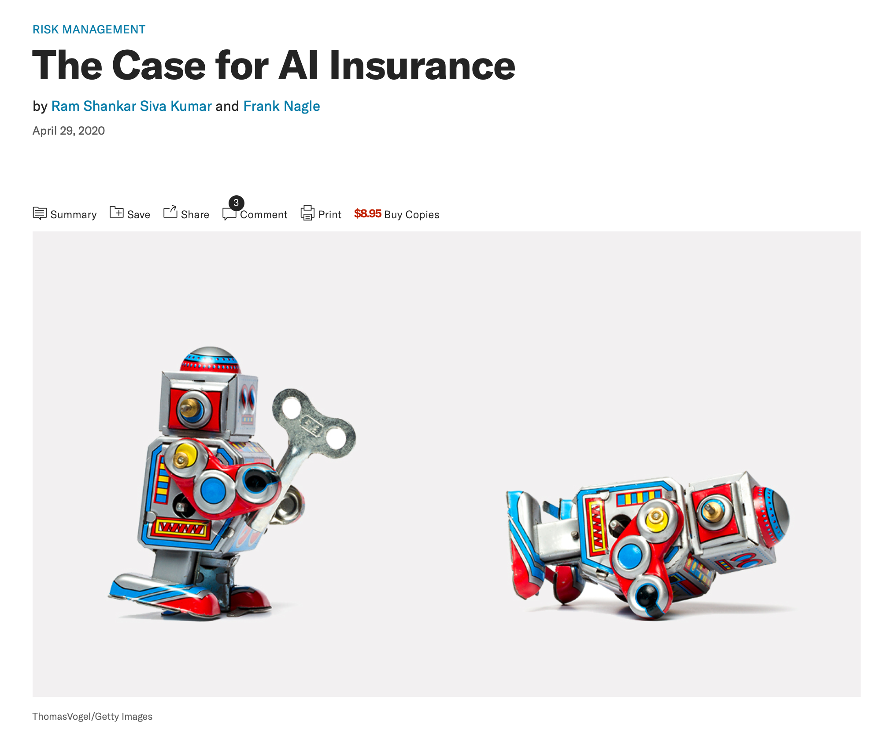

A [tweet about AI and insurance](<(https://twitter.com/latrobe/status/1184947462882123777)>) (again, no robotics):
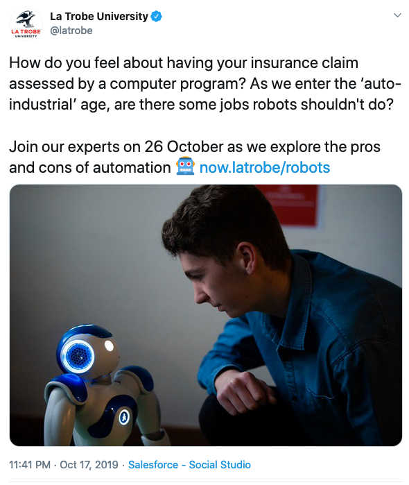

In these three examples, there is no real problem with the robot picture itself; it’s rather its placement next to an article or discussion that has nothing to do with robots. In fact, the robots in the first and third examples (R2D2 from Star Wars and a [programmable humanoid robot called Nao](<https://en.wikipedia.org/wiki/Nao_(robot)>)) are pretty cool robots. At the same time, the fact that the article only talks about forms of ‘AI’ which are essentially just fancy data-driven computer programs means that there is something quite misleading about making the connection to sci-fi robots like R2D2 or even to existing robots like Nao.

Finding ‘pure’ examples of this category of ‘inappropriate placement of okay robot picture’ is quite difficult, however, because in addition to being inappropriately placed, pictures of robots tend to be really, really terrible. As such, let us now turn to the second phenomenon: terrible robots.

##Terrible robots
So what makes a robot picture terrible? Well, there seem to be a few typical ways in which things can go wrong, so here is a non-exhaustive list of the main offenders:

- absurd sexualisation & perpetuation of gender stereotypes;
- default whiteness;
- robots performing ridiculous activities;
- and just generally cringy-looking robots.

Let’s look at these one by one.

###Why the sexualisation?
One of the most common ways that pictures of robots are awful is through absurd sexualisation of the robots and perpetuation of gender stereotypes:
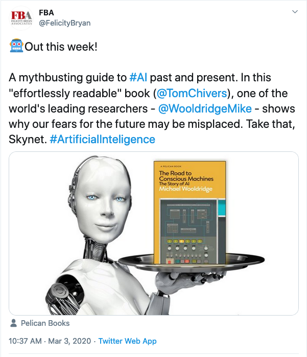

Looking at this [tweet from Pelican Books](https://twitter.com/FelicityBryan/status/1234775007148101634), it's obviously questionable whether a robot holding a book on a silver platter is the best way to illustrate a book that claims to be a ‘mythbusting guide to AI.’ Even ignoring that decision, however, we still have to ask why the robot needs to be sexualised: why does it have ‘breasts’? Why does it have a smirk and a ‘seductive’ gaze? And, moreover, why does the promotional material for a book about AI need to picture it being presented on a silver platter by a female servant?

There is, unfortunately, no shortage of examples of this phenomenon. One news outlet chose the image below to illustrate [an article about a study](https://www.vox.com/future-perfect/2019/8/2/20746236/ai-robot-empathy-ethics-racism-gender-bias) that investigated whether people reacted differently to robots depending on whether they were black or white:
[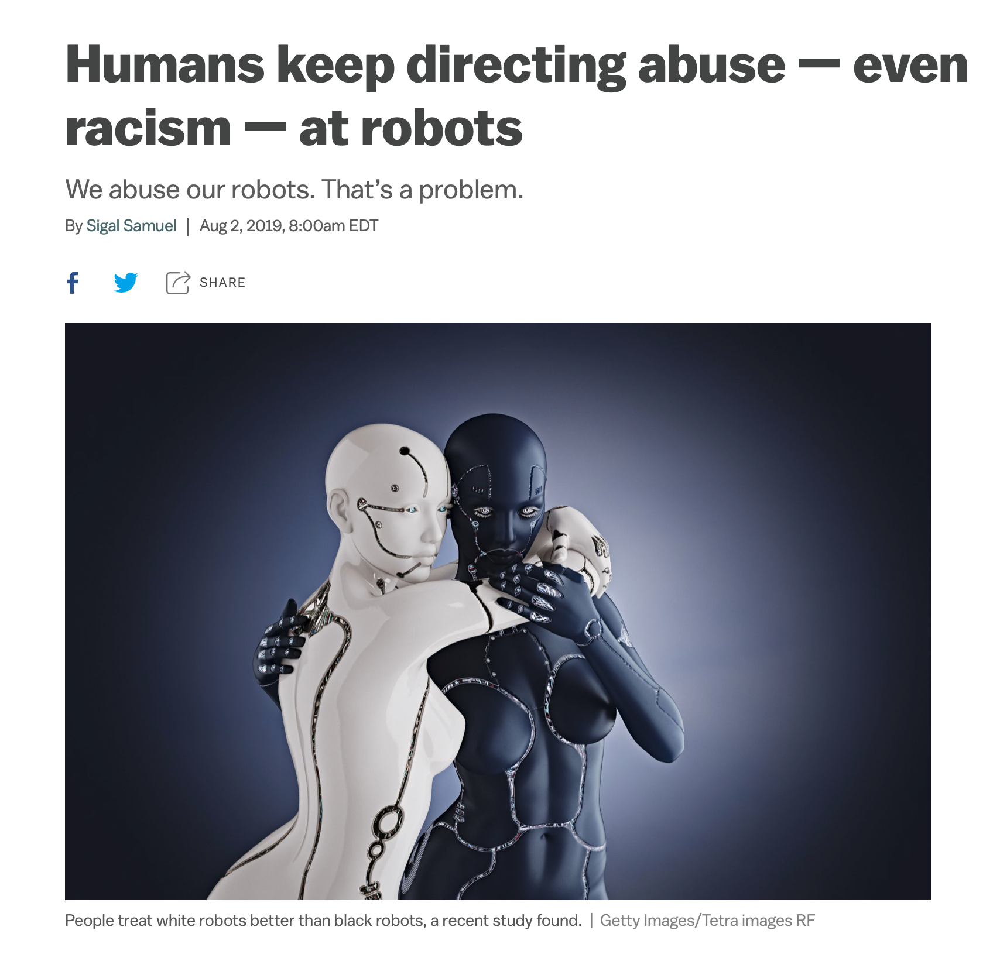](https://www.vox.com/future-perfect/2019/8/2/20746236/ai-robot-empathy-ethics-racism-gender-bias)
Presumably the robots in the study did not have breasts and toned abs, so why this picture? Would it not have been more appropriate to feature a picture of the actual robots used in the study?

Another absurd robot that pops up quite often is this one with unnecessary breasts and, bizarrely, some kind of incredibly inconvenient wires coming out of its head:

The sexualisation of pictures of robots (and real life robots) is just part of a [huge problem in the broader field of AI](https://theconversation.com/artificial-intelligence-has-a-gender-bias-problem-just-ask-siri-123937). Much has been written about the harms caused by the <rich-link text="gendering of AI assistants,">See, for example, Alexa Steinbrück's article, [_Personified Machines_](https://medium.com/@alexasteinbrueck/personified-machines-29875268f151), or UNESCO's report [_I'd blush if I could_](https://en.unesco.org/EQUALS/voice-assistants) for an examination of the gendering of AI technology</rich-link> such as Amazon’s Alexa, and we have also seen how AI systems can perpetuate gender bias in hiring and allow for new forms of harassment against women. For more on these issues, see the myth ["AI can be objective/unbiased"](/ai-can-be-objective-or-unbiased).

Although stupid pictures of feminized robots with inexplicable breasts may not be the most serious form of gender discrimination in the field of AI, it could perhaps be the easiest one to stop. It would take nothing more than the simple step of not using pictures of feminized and sexualised robots to illustrate articles about AI. And, on the most basic level, not giving robots breasts.

###Why so white?

Another notabe feature of these robots is that they are overwhelmingly white, and so are the humans that appear alongside them. As Dr. Beth Singler discovered in [her investigation of the ‘AI Creation Meme’](https://www.mdpi.com/2077-1444/11/5/253) (an example of which is pictured above), in the 79 examples of this meme that she found, the human hand in all 79 cases was white, and, to come back to our previous point about gender, the human hand was male in 78 out of 79 cases. 

Beyond just this example of white human hands appearing in these pictures, there is also the overwhelming whiteness of the robots themselves. A quick search of any of the large stock image databases for the term AI reveals that most of the images are of white robots. Why are they always white? Is it because it’s a ‘neutral’ colour?

The whiteness of these robots seems to be a classic case of white being taken as the <rich-link text="default colour">David Gunkel has been tireless in pointing out the unbearable whiteness of these images on [his Twitter account](https://twitter.com/David_Gunkel/status/1163483767996059649). A related discussion has also taken place about the diversity of emojis, see for example [_Emoji diversity: how 'silly little faces' can make a big difference _](https://www.theguardian.com/technology/2016/nov/07/emoji-diversity-texting-emojicon-san-francisco.) For a discussion of the problem of whiteness as a default, see [_Why is white the default?_](https://medium.com/gender-theory/why-is-white-the-default-23a5d0df5564), by Josh Nguyen, and Sarah Ahmed's article, [_A phenomenology of whitness_](https://static1.squarespace.com/static/58ad660603596eec00ce71a3/t/58bec74415d5db1951fa9f15/1488897863830/Phenomenology+of+Whiteness.pdf)</rich-link>. In their paper, [*The Whiteness of AI*](https://link.springer.com/article/10.1007/s13347-020-00415-6), Stephen Cave and Kanta Dihal note the seriousness of this overwhelming Whiteness when they say that “AI racialized as White allows for a full erasure of people of color from the White utopian imagery.” By centering whiteness as the default colour of the future, these images contribute to envisioning a technological future that excludes people of colour in much the same way that Big Tech today does.

###Do robots dream of unnecessary appliances?
A less serious, but no less prevalent, form of terribleness can be seen in the plethora of ridiculous images of robots using electronic appliances for which they could have no conceivable need. Among the most common offenders are:

Robots typing on keyboards...
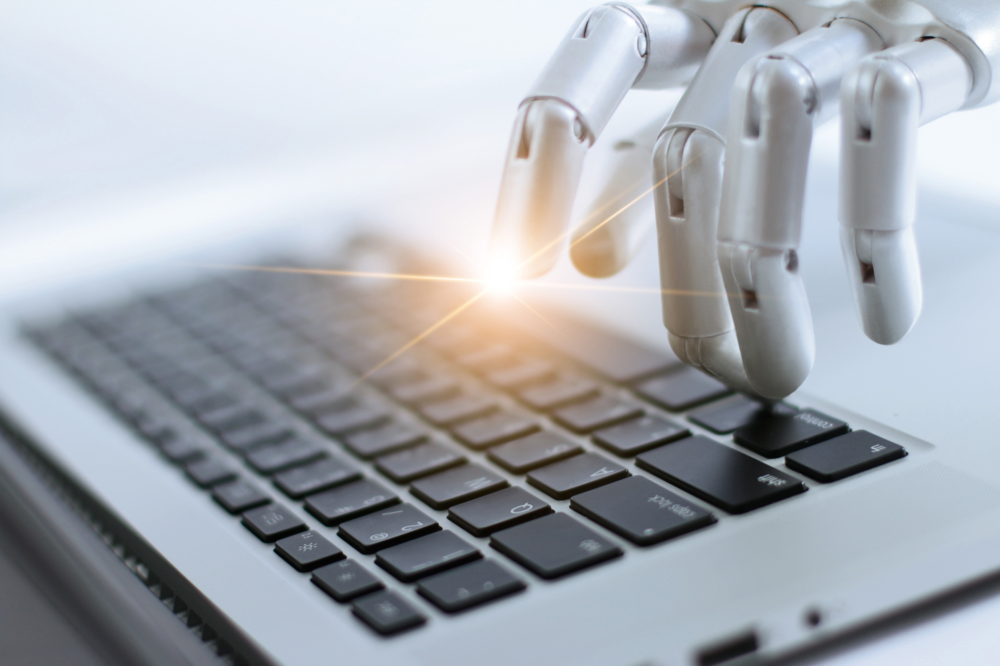

...robots using calculators (presumably doing their taxes for the [robo tax](https://ec.europa.eu/digital-single-market/en/blogposts/should-robots-pay-taxes))...
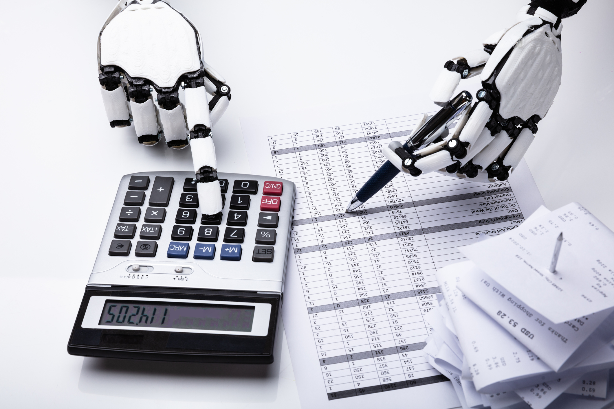

...robots wearing headphones and using laptops in the classic 'call centre' image...
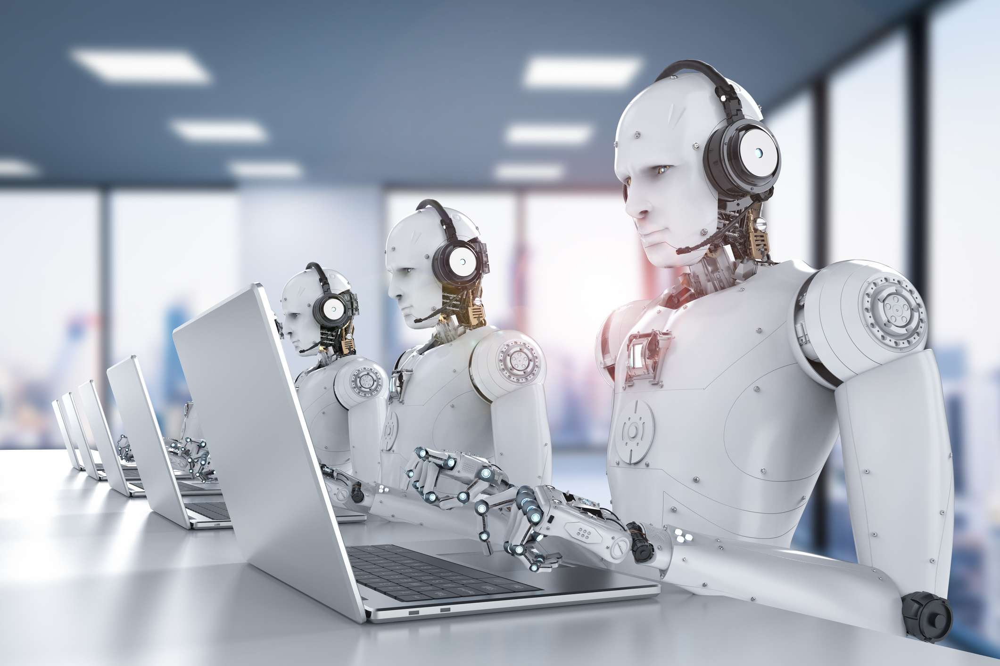

...robots using blackboards...
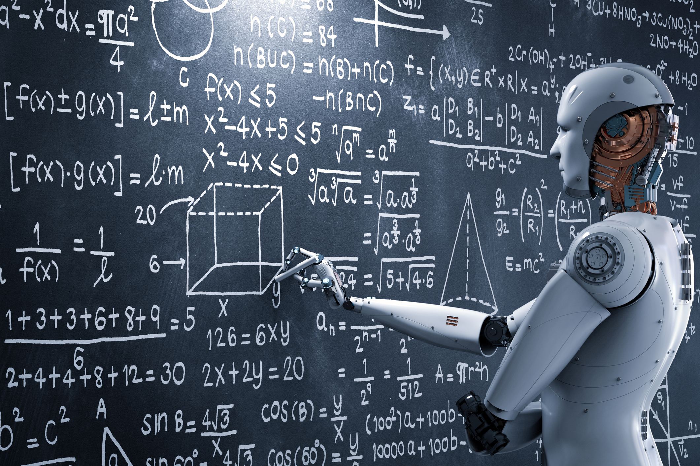

...and robots wearing headphones, typing on keyboards and having loads of flying neon ‘internet symbols’ emerging from their chest:

We have even found a robot using a stethoscope, into which the creator of the image somehow managed to shoehorn a semi-naked woman just to make things more unnecessarily terrible:
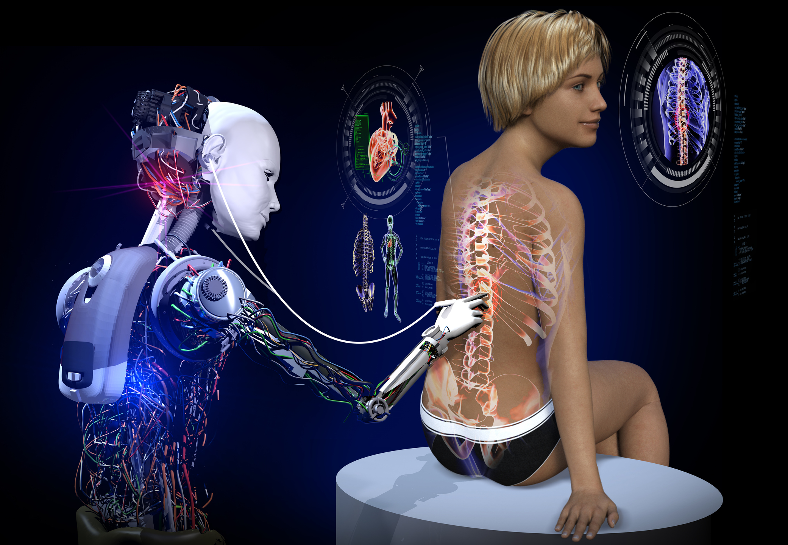

###Just plain cringy-looking robots
Finally, and least seriously, there is an entire genre of images of robots that just look plain crappy. There are many ways in which these images of robots end up looking awful, but here are a couple of illustrative examples:

Robot sitting cross-legged on an office chair:
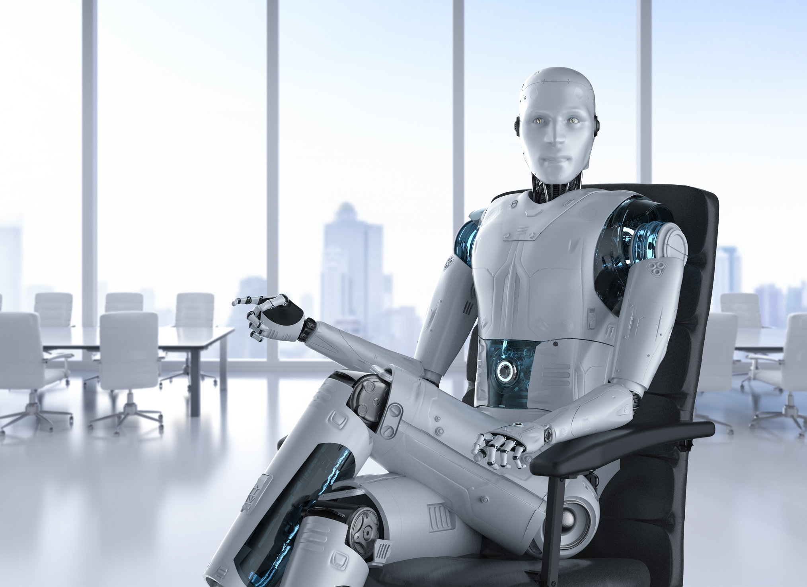

Robot with very pronounced eyebrows (and unnecessary breasts) looking at a digital brain:
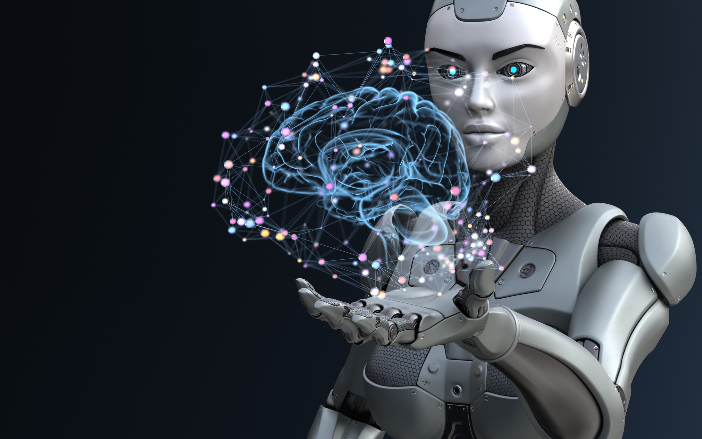

Cringy looking robot in a bad suit:
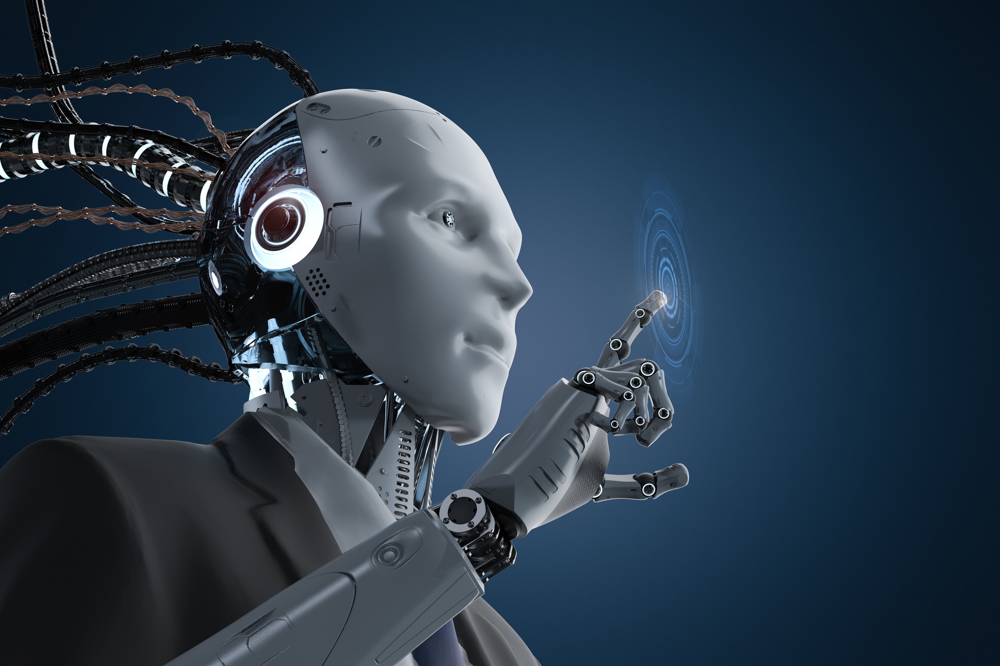

There seems to be no end to the ridiculousness and innovative terribleness of these pictures, so we won’t attempt to be exhaustive here. However, if you want to delve deeper into this, we recommend checking out this project, [Is Seeing Believing](https://www.sciartmagazine.com/perception-is-seeing-believing.html), from Anne Trouillet Rogers and Lisa Talia Moretti who have analysed over 1,000 images depicting AI. Their analysis goes beyond what we've discussed here, taking in the brave new world of big blue brains and vortexes of big data, and providing a fascinating analysis of how we envision and imagine AI.

##How can we stop the terrible and inappropriate robots?
Although there are many more serious problems with robots to which we should all devote our energies, such as the [Campaign to stop killer robots](https://www.stopkillerrobots.org/), the problem of inappropriate and terrible robots is relatively easy to fix, so it's worth noting a few positive actions people could take.

To avoid the problem of inappropriate robots, there is one simple rule: **if your article or report is not explicitly about humanoid robots, do not illustrate it with a picture of a humanoid robot.** It’s that simple.

However, just to make it abundantly clear, here are some examples:

- Chatbots are computer programs. They don’t have hands, they don’t type.
- Using AI in call centers means using computer programs. Not stupid looking white robots with headphones.
- Using AI in insurance does not mean talking to humanoid robots. It's just software.

Things get only marginally more complex for the problem of terrible robots. If you have affirmed beyond all doubt that you actually need a picture of a robot, there are a number of considerations you should take on board:

- Please consider whether it should have breasts or not. In all cases, the answer is that it should not. Unless, bizarrely, you happen to be writing an article about some kind of humanoid robot that definitely has breasts, and this is the main point of the article.
- If your robot is using an appliance, take a moment to consider whether it might just have some kind of inbuilt sensor or actuator that could accomplish the task. To help with this, as it seems clear that help is needed, we could list the following items that futuristic robots certainly would not need:
  - headphones
  - keyboards
  - stethoscopes (and probably most physical measuring devices)
  - blackboards
  - calculators

We do, of course, acknowledge that representing AI visually can be quite a challenge. Nevertheless, we do have faith that with some minimal effort, we could stop using inappropriate and terrible pictures of robots to do the job. Below you can find some examples of alternative approaches to illustrating AI, along with some suggested readings to explore the problem of representing AI more deeply.

Did we miss something in our discussion of inappropriate and terrible pictures of robots? Is there another paradigmatic way in which these images end up looking awful? Or do you have a particularly good example to share? Please get in touch and let us know!
