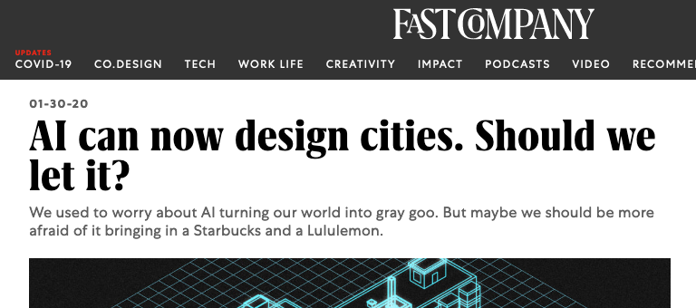
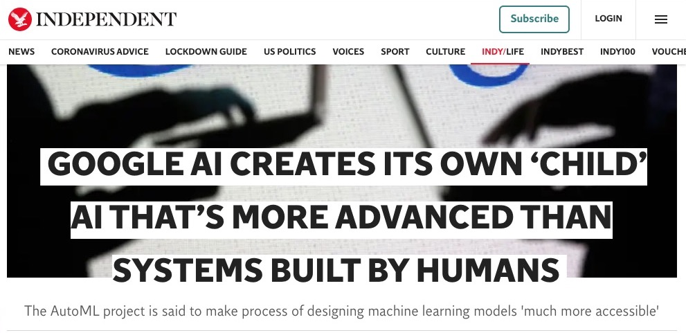

<align-right><a href="#headline-rephraser">Click here see more rephrased headlines!</a></align-right>

AI is everywhere in the news, and we've all seen headlines like these:

- <rich-link text="AI can now design cities, but should we let it?"></rich-link>
- <rich-link text="For The First Time Ever, A Drug Developed By AI Will Be Tested In Human Trials"></rich-link>
- <rich-link text="Google AI creates its own ‘child’ AI that’s more advanced than systems built by humans"><rich-link>

Each of these headlines has something in common: they all speak of AI as something that has agency. Instead of saying “people can use an AI system to,” these headlines make it sound as though some artificially intelligent being is performing an action of its own accord and according to its own desires.

<rich-link text="Some people would argue">Regarding robots and agency, Kate Darling has argued that anthropomorphisation of robots is desirable in certain instances: [_“Who’s Johnny?” Anthropomorphic framing in human-robotinteraction, integration, and policy_](http://www.werobot2015.org/wp-content/uploads/2015/04/Darling_Whos_Johnny_WeRobot_2015.pdf). Daivd Gunkel has also discussed the idea, see for example his article [_The other question: can and should robots have rights?_](https://link.springer.com/article/10.1007/s10676-017-9442-4), or this podcast where he speaks to John Danaher on the topic: [_Philosophical Disquisitions: Episode #48 - Gunkel on Robot Rights_](https://philosophicaldisquisitions.blogspot.com/2018/10/episode-48-gunkel-on-robot-rights.html). Nevertheless, few people would make such arguments for the type of rudimentary machine learning systems that most articles about 'AI' are discussing.</rich-link> that there’s nothing wrong with this: it’s a very natural, and possibly even beneficial tendency we have. At the same time, we found that this issue got the most votes in our survey on harmful myths and misconceptions about AI. So why is it a problem? Let’s take a closer look at the first headline to see why:

<rich-link text="AI can now design cities, but should we let it?"></rich-link>

What do we mean here when we say that ‘artificial intelligence’ can design cities? We are certainly not talking about some self-conscious superintelligence that of its own free will designs cities. No, in this case, we are talking about a group of researchers using a machine learning system to do two things: firstly, to analyse survey data about what images of streets people find beautiful or ugly; secondly, to edit images of ‘ugly’ streets to make them conform better to what people find beautiful.

While this certainly sounds like an interesting tool for urban planning, it's a far cry from what most people will think when they read Fast Company’s original headline. A more deflationary version of the headline might say that “a group of researchers can use a computer program to help design cities by analysing data about what people like and don’t like.” This certainly sounds less promising and innovative, than Fast Company’s version, but it's much more accurate.

What's most important about this rephrasing is how it changes our approach to the question which follows: **should we let it**? When we hear that ‘AI can now design cities’, we might feel as though we are at the threshold of some sci-fi future, and perhaps feel a curiosity to ‘let AI’ try its hand at designing cities. After all, most of us have had to deal with the bad urban planning decisions of our fellow humans, so why not let AI have a go? But when we hear that some people claim that they have a really good computer program for designing cities, I’m willing to bet that we’re all a bit more circumspect to let ‘them’ design cities.

Once we know how the system actually works, one obvious question we would ask is whether the people who rated the streets represent the diversity of the populations in those cities. If, for example, the people rating the streets were mostly young, White, and middle class, this urban planning tool could end up being a tool that simply furthers the gentrification of cities. This is precisely the type of question that people won’t ask, however, if they think that ‘an AI’ came up with the designs all 'by itself.’

##Hiding human agency
Another clear danger, which may be seen as an advantage by the more ill-intentioned among us, is that the ascription of agency to AI can quite effectively **mask the human agency behind certain processes**. This might seem relatively harmless in certain cases, such as the example above of using an AI system to analyse people’s preferences for making their streets look pretty. However, in the majority of cases we’re done a disservice when we’re presented with misleading claims about AI doing something when it is very clearly a case of humans using AI to do things.

No AI system, no matter how complex or ‘deep’ its architecture may be, pulls its predictions and outputs out of thin air. All AI systems are designed by humans, are programmed and calibrated to achieve certain results, and the outputs they provide are therefore the result of multiple human decisions.

In the article [_Black-boxed politics - opacity is a choice in AI systems_](https://t.co/elyk24K15P?amp=1), the authors list a number of the controversial human decisions that go into the design of any AI system:

> Owners of AI systems and the data scientists they employ are responsible for the choices made at each stage of development: for the choice of the data, even if that choice was very limited; for deploying the system despite the fact that they could not avoid bias; for not revising their main objective, regardless of the fact that the fair outcome they hoped for could not be achieved; and, finally, they are responsible for choosing to use an automated system in the first place, despite being aware of its limitations and possible consequences.

When we fail to see these decisions (or when they are deliberately masked), we end up seeing AI systems as finished products, as systems that simply take input data and output objective results. This contributes to what Deborah G. Johnson and Mario Verdicchio call **sociotechnical blindness** in their article [_Reframing AI Discourse_](http://medsci.cn/sci/show_paper.asp?id=8ac8e115e52c18e5): "What we call sociotechnical blindness, i.e. blindness to all of the human actors involved and all of the decisions necessary to make AI systems, allows AI researchers to believe that AI systems got to be the way they are without human intervention."

Instead of seeing AI systems as detached from human agency and decisions, Johnson and Verdicchio propose that we see them as part of **sociotechnical ensembles**:

> An AI system consists of a computational artefact together with the human behaviour and people who make the artefact a useful and meaningful entity [...] AI systems should be thought of as **sociotechnical ensembles [i.e.] combinations of artefacts, human behaviour, social arrangements and meaning**. For any computational artefact to be used for a real-world purpose, it has to be embedded into some context in which there are human beings that work with the artefact to accomplish tasks

When we speak about AI systems, it's important that we do so in a manner that makes them visible as sociotechnical ensembles, imbued with human decision making and human flaws, rather than as neutral technical systems.

##Hiding human labour
Although the Fast Company headline is a relatively banal case of a sensationalist headline obscuring how a piece of technology actually works, there are more sinister cases in which we are told that “AI is doing something” and are thereby blinded to the human labour underlying that process.

Astra Taylor has [proposed the term fauxtomation](https://logicmag.io/failure/the-automation-charade/) to refer to these misleading cases of shiny promises of automation <rich-link text="masking the grim reality of human labour:">Two excellent books that expose this hidden labour are [_Ghost Work_](https://ghostwork.info/) by Mary Gray & Siddharth Suri and [_Behind the Screen_](https://yalebooks.yale.edu/book/9780300235883/behind-screen) by Sarah T. Roberts. You can also check out this article from The Verge, [_The Trauma Floor: The Secret Lives of Facebook Moderators in America_](https://www.theverge.com/2019/2/25/18229714/cognizant-facebook-content-moderator-interviews-trauma-working-conditions-arizona), and the documentary [_The Cleaners_](https://www.pbs.org/independentlens/films/the-cleaners/)</rich-link>

> Fauxtomation manifests every time we surf social media, check out and bag our own groceries, order a meal through an online delivery service, or use a supposedly virtual assistant that is, surprise, in fact powered by human beings. Yet even though we encounter this phenomenon everyday, we often fail to see, and to value, the human labor lurking behind the high-tech facade (even if it’s our own). We mistake fauxtomation for the real thing, reinforcing the illusion that machines are smarter than they really are.

We need to be alert to how human labour is masked behind the facade of fancy-sounding AI systems, whether it is in the arduous and underpaid work of labelling datasets, or in cleaning up the mess made by algorithmic errors.

A particularly interesting case of dubious AI agency can be found in the <rich-link text="2019 scandals about AI voice assistants">The human review of recordings from these voice assistants was exposed for [Google Assistant](https://www.vrt.be/vrtnws/en/2019/07/10/google-employees-are-eavesdropping-even-in-flemish-living-rooms/), [Apple's Siri](https://www.theguardian.com/technology/2019/jul/26/apple-contractors-regularly-hear-confidential-details-on-siri-recordings), [Amazon's Alexa](https://www.theguardian.com/technology/2019/apr/11/amazon-staff-listen-to-customers-alexa-recordings-report-says), [Mircosoft's Cortana](https://www.vice.com/en_us/article/xweqbq/microsoft-contractors-listen-to-skype-calls), and similarly for [Facebook's Messenger](https://www.bloomberg.com/news/articles/2019-08-13/facebook-paid-hundreds-of-contractors-to-transcribe-users-audio)</rich-link>. Many users were shocked to learn that their beloved voice assistants, whether it be Siri, Alexa, or Google Assistant, were actually transmitting recordings of conversations to be analysed by human reviewers.

This is, however, a normal part of how these systems are improved: human reviewers listen to samples of interactions to understand, for example, where and why the device made a mistake. In many cases, these reviewers heard recordings of sensitive conversations with doctors, users requesting the assistant to search for porn, couples having sex, and even drug deals.

There is something very curious happening here: on the one hand, these voice assistants are anthropomorphised, in most cases in a <rich-link text="problematically gendered way as subservient women,">See, for example, Alexa Steinbrück's article, [_Personified Machines_](https://medium.com/@alexasteinbrueck/personified-machines-29875268f151), or UNESCO's report [_I'd blush if I could_](https://en.unesco.org/EQUALS/voice-assistants) for an examination of the gendering of AI technology</rich-link> such that people get the feeling that they are interacting with a futuristic, intelligent being; on the other hand, the real human labour going on behind the scenes, whether it is the initial labelling of training data, or in the later analysis of recordings by human reviewers, is masked from the user.

For a vivid illustration of the complex system of human labour that underlies these voice assistants, check out the project [_Anatomy of an AI system_](https://anatomyof.ai/) which looks at "Amazon Echo as an anatomical map of human labor, data and planetary resources":

> The stack that is required to interact with an Amazon Echo goes well beyond the multi-layered ‘technical stack’ of data modeling, hardware, servers and networks. The full stack reaches much further into capital, labor and nature, and demands an enormous amount of each. The true costs of these systems – social, environmental, economic, and political – remain hidden and may stay that way for some time.

To circle back to our original point about bad headlines, we should consider Astra Taylor’s remark that even the common concern that “robots will take our jobs” is based on ascribing agency to AI, or in this case robots, where in fact the agency belongs firmly to those humans at the top of the capitalist food chain:

> The phrase “robots are taking our jobs” gives technology agency it doesn’t (yet?) possess, whereas “capitalists are making targeted investments in robots designed to weaken and replace human workers so they can get even richer” is less catchy but more accurate.

The major lesson here is that whenever we hear that “AI can do X”, we should always break that statement down to uncover the human decisions and human labour that allow that AI system to accomplish whatever task it claims to be able to perform.

To illustrate the absurdity, and sometimes outright deceptiveness, of bad AI headlines, we've put together this interative widget for you. In one box, you'll find some of the all-time worst AI headlines. In the other, you'll see a 'debunk' button. When you click on it, the headline will be rephrased in a more accurate, if slightly cheeky manner. Give it a go!

##Headline rephraser

<agency-widget></agency-widget>
<call-to-action>And if you come across a headline that is so terrible that you think it should be included here, please <a href="https://www.aimyths.org/about#contact">send it to us!</a> </call-to-action>

## How to do things better

The excellent (and free) online course, [_Elements of AI_](https://course.elementsofai.com/), gives us a great tip that can help us to avoid some of the issues outlined above when they stress that **“AI” is not a countable noun**:

> When discussing AI, we would like to discourage the use of AI as a countable noun: one AI, two AIs, and so on. AI is a scientific discipline, like mathematics or biology. This means that AI is a collection of concepts, problems, and methods for solving them.
> Because AI is a discipline, you shouldn't say “an AI“, just like we don't say “a biology“. This point should also be quite clear when you try saying something like “we need more artificial intelligences.“ That just sounds wrong, doesn't it? (It does to us).

The people at the website SkynetToday have produced an excellent set of [AI Coverage Best Practices](https://www.skynettoday.com/editorials/ai-coverage-best-practices), based on a survey of leading AI researchers. On the question of ascribing agency to AI they echo the previous tip when they say the following:

> ...it is misleading to say, for example, “An Artificial Intelligence Developed Its Own Non-Human Language”, since AI is not a single entity but rather a set of techniques and ideas. A correct usage is, for example, “Scientists develop a traffic monitoring system based on artificial intelligence."

We can go even further than this, and specify what particular technique was used in a given case. As an example, instead of saying "AI can now read your text messages," we could more accurately say that "Researchers can use natural language processing (NLP) tecniques to scan your messages."

Someone could object that specifying the particular technique here is likely to make the story less interesting, but this is precisely the point a lot of the time: stories about advances on NLP benchmarks which are not actually of interest to the general public are distorted and overhyped by using the term AI instead of more particular terms.

Even without going to the depth of using terms such as NLP, simply replacing AI with machine learning (ML) already makes most stories more accurate and less like sensationalist clickbait. For more on these terminological nuances, check out the [the term AI has a clear meaning](/the-term-ai-has-a-clear-meaning).

Skynet Today provide a number of other guidelines, which we've listed here:

<dos-donts></dos-donts>

Check out their article on [AI Coverage Best Practices](https://www.skynettoday.com/editorials/ai-coverage-best-practices) for more info on these.

Gary Marcus has also outlined <rich-link text="6 questions to ask yourself when reading about AI">These can be found on p.9 of his book [_Rebooting AI_](http://rebooting.ai/), or in this [paywalled article on Quartz](https://qz.com/1706248/six-questions-to-ask-yourself-when-reading-about-ai/)</rich-link> that aim to cut through much of the typical hype:

- Stripping away the rhetoric, what did the AI system actually do here?
- How general is the result? (E.g., does an alleged reading task measure all aspects of reading, or just a tiny slice of it?)
- Is there a demo where I can try out my own examples? (Be very sceptical if there isn’t.)
- If the researchers (or their press people) allege that an AI system is better than humans, then which humans, and how much better?
- How far does succeeding at the particular task reported in the new research actually take us toward building genuine AI?
- How robust is the system? Could it work just as well with other data sets, without massive retraining?

All of these questions and guidelines can help us to counter the effects of ascribing agency to AI and other forms of mystification, and hopefully make us better readers and writers when it comes to these topics.

##Extra topic: legal personality for AI
_This section was written by Rachel Jang as part of a project for the Harvard Law School Cyberlaw Clinic at the Berkman Klein Center for Internet & Society. Further edits were made by Daniel Leufer._

This idea of ascribing agency to AI goes beyond just the sort of linguistic misrepresentations discussed above, and can lead to people wanting to radically alter our legal systems in order to accommodate ideas which might seem quite far fetched. For example, there has been ongoing debate about whether 'an AI' can own the intellectual property for something 'it invents.' Based on what we have said about it, it would seem more straightforward to say instead that some scientists used an AI system to invent something. In this case, the idea of 'an AI' holding the intellectual property seems quite bizarre.

Digging a bit further into this problem, we can ask ourselves who might benefit from 'an AI' (developed by a private company, of course) being able to hold copyright. Similarly, if 'an AI' could hold legal personality, it seems likely that companies could use this to evade responsibility by having the system held responsible 'for its actions' rather than having to be held liable for the behaviour of systems they have designed.

Currently, the international consensus in patent law is that AI cannot be an inventor of a patent. This rule was tested and reconfirmed recently in 2020, when the European Patent Office and the U.K. Intellectual Property Office both refused patent applications which identified the Dabus AI as the inventor. The applications [sought patents](https://legal-patent.com/patent-law/ai-dabus-autonomous-inventor-but-not-official/) for a "[**beverage container**](http://artificialinventor.com/wp-content/uploads/2019/07/Fractal-Container-Application.pdf)" and a device "[**to attract optical attention like a lighthouse during search operations**](http://artificialinventor.com/wp-content/uploads/2019/07/Neural-Flame-Application.pdf)." Designing a slightly improved bottle and a fancy flashlight certainly sounds a lot less spectacular than what most people would imagine when they hear that 'an AI invented something.' Nevertheless, it is interesting to look into the idea that 'an AI' could be credited with inventing these things, especially as these claims are likely the tip of the iceberg. The answer to this debate about AI systems holding patents may have significant implications because were an AI system to be granted the legal status of an inventor, it might lower barriers to legal entitlements such as being able to enter into contracts and file lawsuits.

Depending on your view of the current capabilities of AI systems and how rapidly they are likely to improve in the coming years, the idea of granting a patent to an AI system may seem absolutely absurd or admirably prescient. No matter what view you take, however, there is in fact legal precedence for non-humans to have the kind of legal status that would be required to hold a patent. Around the world, many non-humans are given the privileges of “[legal personhood](https://link.springer.com/chapter/10.1007/978-3-319-78881-4_2),” with the capability to hold rights or duty and the ability to carry responsibility. A legal person can sue, be sued, and enter into contracts with other legal persons. Corporations, states, cooperatives, and even some natural features like rivers or animals, have been treated as legal persons.

In 2017, the Saudi Arabian government granted Sophia the Robot citizenship. The decision may have been a publicity stunt, but many people have argued that the recognition of legal rights for robots eroded human rights. As Robert David Hart said in a [piece on Quartz](https://qz.com/1205017/saudi-arabias-robot-citizen-is-eroding-human-rights/),

> In a country where the laws allowing women to drive were only passed last year and where a multitude of oppressive rules are still actively enforced (such as women still requiring a male guardian to make financial and legal decisions), it’s simply insulting. Sophia seems to have more rights than half of the humans living in Saudi Arabia.

Still, Saudi Arabia is not alone: Japan took a similar step by [granting residency in Tokyo to Shibuya Mirai](<(https://www.newsweek.com/tokyo-residency-artificial-intelligence-boy-shibuya-mirai-702382)>), a chatbot on a messaging app.

The European Union has also flirted with this idea, with the European Parliament’s proposal to establish a specific legal status of “electronic persons” for robots. The [European Parliament’s report](<(http://www.europarl.europa.eu/doceo/document/JURI-PR-582443_EN.pdf?redirect)>) called on the European Commission to explore the possibility of applying the electronic personality concept to “cases where robots make smart autonomous decisions.” An [open letter signed by more than 150 European AI experts](http://www.robotics-openletter.eu/) strongly opposed the proposal, largely pointing to overvaluation of actual AI capabilities and concern for liability issues. The European Commission did not accept the European Parliament’s proposal in the Commission’s outline of future strategy to address artificial intelligence, effectively rejecting the idea of electronic personhood.

As the experts’ letter to the European Commission pointed out, the motivation for ascribing more agency or legal personhood for AI comes from the idea that we need a new system to address the rapid development of AI technology. However, this line of thinking overstates where the world is currently at with AI technology. One problem is that the term ‘artificial intelligence’ tends to make us overestimate capabilities. Instead of calling the DABUS system ‘an AI,’ we could more accurately call it a computer program that uses advanced statistical methods, and it suddenly sounds far less plausible to grant it a patent.

Another problem is that a robot like Sophia the Robot that looks somewhat like a human and that seems to answer people’s questions on the spot may [trick people](https://www.cnbc.com/2018/06/05/hanson-robotics-sophia-the-robot-pr-stunt-artificial-intelligence.html) into thinking that robots capable of human-level intelligence are not far off. The reality is that we currently only have what is termed ‘narrow intelligence’ in AI systems, where the system can perform well at one very narrowly defined task, but is usually back to square one when even the slightest variation is introduced to a task.

Indeed, achieving anything like **Artificial General Intelligence** (where a machine could perform intelligently across a range of complex tasks) is not simply a matter of adding more data and more computational power, but is a problem for which nobody has any kind of roadmap (for more on this, see: [Superintelligence is coming soon](/superintelligence-is-coming-soon)).

A more serious implication of ascribing agency and personhood to AI has to do with accountability. One of the main arguments in favor of AI personhood is based upon the “[black box](https://medium.com/@szymielewicz/black-boxed-politics-cebc0d5a54ad)” narrative about AI, and particularly machine learning systems. When systems employ complex algorithms, such as neural networks or support vector machines that ‘learn’ from large datasets, it can often be difficult for their programmers to understand the precise mechanisms by which they produce results. This means that there is a certain opacity to their operation, and they often produce results that are surprising to their human programmers.

In some cases, these surprising results have been due to serious errors and could have had life-threatening consequences. In other cases, they have produced exciting and novel results that a human would have been unlikely to arrive at. In the case of AI personhood, this opacity is taken to signify a sort of ‘creative independence’, such that the AI decision-making processes are independent of their creators, and thus their creators should not be responsible for them.

In this case of granting the AI system a patent, this may seem like generosity on behalf of the programmer: Dr. Stephen Thaler doesn’t wish to take credit for the ‘inventions’ of DABUS because he couldn’t have invented those things himself. Granting legal personhood seems a lot less like generosity, however, when we think about the patented ‘invention’ of an AI system causing harm: isn’t the granting of personhood just a convenient way for the system’s creators to avoid accountability? Every system, whether it uses complex machine learning algorithms or not, is the result of human decisions, and we should be careful about being misled about the role and responsibility of those who design and deploy these systems.

It may well be that existing legal systems can address the issues AI personhood is trying to solve. For instance, when trying to figure out where liability lies for a harmful action caused by an AI system we can turn to [tort law](https://www.law.cornell.edu/wex/tort) and existing legal doctrines, such as strict product liability or vicarious liability. Strict product liability is a legal doctrine where the supplier of a product is held liable for harms caused by the product regardless of whether the supplier was negligent or not.

Under this doctrine, AI systems that fall below an acceptable rate of error can be deemed defective, which can then be used to impose liability on the parties who contributed to their making. Vicarious liability is a legal doctrine where one party is held liable for the actions of another party when the parties engage in some sort of joint activity. Using the vicarious liability doctrine, an owner of an AI system can be held liable for the system’s tortious act, grouping the owner and the AI system as being engaged in a joint activity. Such concepts in tort law can help apportion faults and liability appropriately when AI systems conduct tortious acts.

In addition, there is also the opinion that current company law in the U.S. can be used to establish legal personhood for AI. [Shawn Bayern has argued](https://papers.ssrn.com/sol3/papers.cfm?abstract_id=2758222) that because legally enforceable agreements can give legal effects to an algorithm under current U.S. law, autonomous systems may be able to mimic some rights of legal persons. Bayern pointed to business-entity statutes, such as LLC statues, as potentially giving algorithmic systems and software the basic capabilities of legal personhood. Although such a view has not obtained significant authority yet, introducing a new concept of legal personhood for AI could lead to more confusion given the possible application of existing law to AI.
